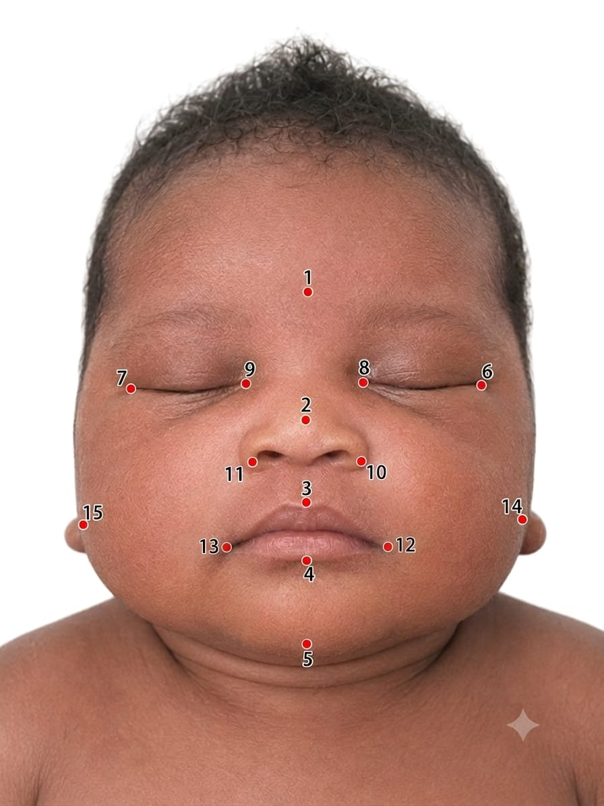
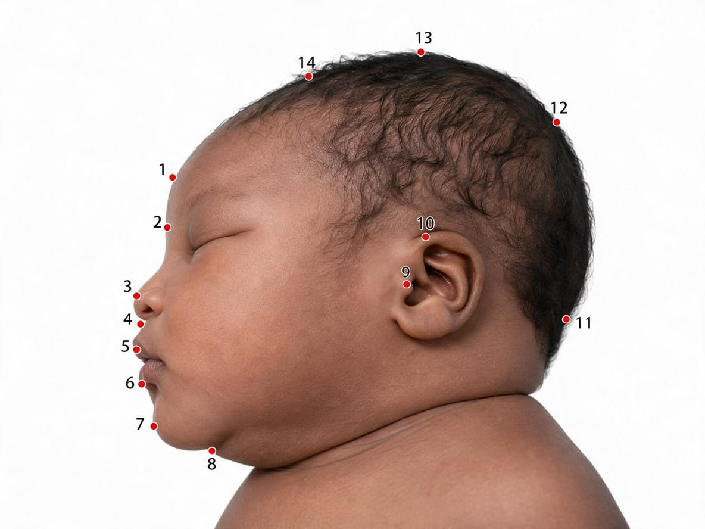

```{r setup, include=FALSE}
knitr::opts_chunk$set(
  echo = FALSE, 
  warning = FALSE, 
  message = FALSE, 
  cache = FALSE,
  fig.align = "center",
  fig.width = 8,
  fig.height = 6,
  out.width = "100%"
)

# Load mandatory frameworks into the active RStudio session
library(geomorph)
library(readxl)
library(dplyr)
library(tidyverse)
library(tidymodels)
library(glmnet)
library(pROC)
library(broom)
library(car)
library(vip)
library(gridExtra)
library(ggrepel)
library(flextable)

set.seed(42)
N_PERM <- 9999

# ----------------------------------------------------------------------------
# Reusable helper for publication-ready tables, styled consistently.
# ----------------------------------------------------------------------------
make_pub_table <- function(df, footnote_text = NULL, align_cols = NULL, max_width_in = 6.5) {
  ft <- flextable(df)
  ft <- theme_booktabs(ft)
  ft <- bold(ft, part = "header")
  ft <- align(ft, align = "center", part = "header")
  if (!is.null(align_cols)) {
    ft <- align(ft, j = align_cols, align = "center", part = "body")
  }
  ft <- fontsize(ft, size = 9, part = "all")
  ft <- padding(ft, padding = 3, part = "all")
  ft <- line_spacing(ft, space = 1, part = "all")
  if (!is.null(footnote_text)) {
    ft <- add_footer_lines(ft, values = footnote_text)
    ft <- fontsize(ft, size = 8, part = "footer")
    ft <- italic(ft, part = "footer")
  }
  ft <- autofit(ft)
  # fit_to_width() shrinks the font to fit a fixed page width -- that's a
  # print-only concept. Only apply it when actually rendering to Word;
  # HTML has no physical page, so let every table keep its full, natural
  # font size there (wide tables just get a horizontal scrollbar).
  if (isTRUE(knitr::pandoc_to("docx"))) {
    ft <- fit_to_width(ft, max_width = max_width_in)
  }
  ft
}
```

**ABSTRACT**

**Objectives:** Human parturition reflects the “obstetrical dilemma” between fetal cranial form and maternal pelvic constraints, implying craniofacial-pelvic morphological integration. Current CPD assessment relies on pelvimetry and linear fetal head measurements, capturing size but not shape. We tested the a priori hypothesis that neonatal craniofacial shape, independent of size, is an anatomical correlate of CPD, comparing anthropometry with geometric morphometric (GM) shape analysis, both measured postnatally in a Nigerian cohort.

**Methods:** In a case-control study, 160 neonates (80 CPD cases delivered by emergency caesarean section; 80 uncomplicated vaginal deliveries) were recruited. Standardised anterior (15-landmark) and lateral (14-landmark) photographs were analysed via geometric morphometrics (Generalised Procrustes Analysis, Principal Component Analysis, Canonical Variate Analysis, Procrustes ANOVA, MANOVA); anthropometric variables' joint association with CPD was assessed by logistic regression.

**Results:** Occipitofrontal diameter (aOR = 1.29, 95% CI 1.11–1.50, p = 0.0012) and birth weight (aOR = 9.38 per kg, 95% CI 1.78–48.94, p = 0.0081) independently predicted CPD; maternal age was protective (aOR = 0.92, 95% CI 0.85–0.99, p = 0.034) (Nagelkerke *R*^2^ = 0.571). After adjustment for maternal covariates and allometry, anterior and lateral craniofacial shape differed significantly between groups (Procrustes ANOVA, F = 5.36, p < 0.001 and F = 3.83, p = 0.0075, respectively).

**Conclusions:** Anthropometry and craniofacial shape both differed significantly between CPD and non-CPD neonates, confirming the hypothesised size-independent shape signal. GM shape captures CPD-relevant information not reducible to linear size, supporting craniofacial-pelvic morphological integration in the obstetrical dilemma. Findings are confirmatory anatomical evidence of this integration, not a deployable screening tool.

*Keywords: craniofacial-pelvic morphological integration; geometric morphometrics; craniofacial shape; cephalopelvic disproportion; Procrustes analysis; fetal anthropometry*

# Introduction

The disproportionate difficulty of human childbirth relative to other primates is classically framed as the "obstetrical dilemma": the evolutionary tension between encephalisation, which favours a large fetal head, and bipedal locomotion, which constrains pelvic breadth [@washburn1960tools; @wells2012obstetric]. This trade-off between fetal cranial form and maternal pelvic architecture is a central theme in human biology and biological anthropology, and cephalopelvic disproportion (CPD) represents its most acute clinical expression. Obstetric risk assessment for CPD has, however, largely proceeded independently of this broader literature on feto-pelvic morphological variation, relying on linear measures of fetal head size rather than on the shape-based approaches used to characterise cranial and pelvic form elsewhere in human biology.

Although geometric morphometrics (GM) is a well-established quantitative framework in evolutionary biology and physical anthropology for capturing complex biological form, its application to clinical obstetric risk assessment remains absent. Traditional obstetric evaluations rely heavily on univariate, linear fetal head dimensions (such as biparietal diameter and head circumference) which capture size but ignore spatial shape configurations [@wu2023global; @betran2021trends]. To our knowledge, this study provides the first quantitative geometric morphometric investigation evaluating size-independent neonatal craniofacial shape as a retrospective marker of cephalopelvic disproportion (CPD).

Cephalopelvic disproportion occurs when the fetal head is too large, or unfavourably shaped, relative to the maternal pelvis to permit safe vaginal delivery, and remains one of the most common indications for emergency caesarean section worldwide. In many low- and middle-income settings, including much of sub-Saharan Africa, limited access to timely caesarean delivery means that unrecognised or late-recognised CPD continues to contribute substantially to obstructed labour, uterine rupture, and adverse maternal and perinatal outcomes [@acog2020macrosomia].

Antenatal and intrapartum assessment of CPD risk relies principally on clinical and radiographic maternal pelvimetry together with simple linear measurements of fetal head size, such as biparietal diameter (BPD), occipitofrontal diameter (OFD), and head circumference (HC), obtained by ultrasound or direct measurement. While these measurements are useful predictors of fetal size, they treat the fetal head as a small number of linear distances rather than as a continuous three-dimensional (or, in photographic studies, two-dimensional projected) form, and cannot capture localised differences in craniofacial shape that are not reflected in any single linear measurement. The present study examines craniofacial size and shape measured postnatally, after delivery, as a retrospective marker of the CPD-associated neonatal phenotype; it does not replicate the antenatal ultrasound-based assessment workflow described above, and translating any postnatally identified shape signal into an antenatally deployable tool remains a distinct and important direction for future work.

Geometric morphometrics (GM) is a well-established quantitative framework, widely used in evolutionary biology and physical anthropology, that captures the full geometry of a set of anatomical landmarks after mathematically removing the effects of position, orientation, and scale (Procrustes superimposition), leaving a pure measure of shape that can be statistically compared between groups [@klingenberg2016size; @zelditch2012geometric]. GM approaches have been applied to craniofacial research in contexts ranging from syndromic diagnosis to forensic identification, but their application to obstetric risk assessment, and to CPD specifically, remains limited.

We tested the a priori hypothesis that neonatal craniofacial shape, independent of size, differs between neonates delivered for CPD and those delivered vaginally without complication, and that this shape difference is not fully explained by differences in fetal size alone; a secondary hypothesis was that this shape signal would be detectable in both an anterior (facial) and a lateral (cranial profile) configuration, consistent with a generalised rather than view-specific pattern of craniofacial-pelvic morphological integration. This study compares traditional anthropometric measurements with geometric morphometric analysis of neonatal craniofacial shape, using standardised anterior and lateral photographs obtained after delivery, in a case-control sample of neonates delivered at Jahun General Hospital, Jigawa State, Nigeria. Both hypotheses were evaluated using confirmatory, permutation-based inferential statistics (Procrustes ANOVA and MANOVA under residual randomisation, 9,999 permutations) specified prior to analysis, rather than post hoc or exploratory comparisons; this design prioritises rigorous a priori hypothesis testing appropriate to a modest but well-characterised cohort over the larger, more heterogeneous samples typically required for purely descriptive or exploratory morphometric surveys. Because both anthropometric and geometric morphometric measurements were obtained postnatally, this study establishes whether such a shape-and-size signal exists and is size-independent, and thereby whether craniofacial-pelvic morphological integration has demonstrable functional anatomical significance in this context, rather than evaluating a tool that could itself be deployed for antenatal risk prediction; whether landmarks equivalent to those used here can be captured antenatally (for example, by three-dimensional or four-dimensional ultrasound) is a separate question requiring dedicated future work.

# Materials and Methods

## Study Design and Setting

This case-control study was conducted at Jahun General Hospital, Jigawa State, Nigeria, over the period [dates]. Ethical approval was obtained from Ethical Committee of Ministry of Health, Jigawa State, Nigeria (JGHREC/2026/2589) and written informed consent was obtained from all participating mothers.

## Participants

Cases (n = 80) comprised neonates delivered by emergency caesarean section for a clinical diagnosis of CPD. Controls (n = 80) comprised neonates delivered vaginally without complication. Neonates with congenital craniofacial anomalies, multiple gestation, or major perinatal complications unrelated to CPD were excluded from both groups.

## Image Acquisition and Landmark Digitisation

Standardised anterior and lateral craniofacial photographs were obtained for each neonate using a fixed camera-to-subject distance of approximately 1 metre, with consistent camera settings (resolution 2448 × 3264 pixels). Fifteen anatomical landmarks were digitised on each anterior image (glabella; pronasale; labiale superius; labiale inferius; gnathion; and bilateral exocanthion, enocanthion, alare, cheilion, and zygion) (Figure \@ref(fig:landmark-scheme-anterior)), and fourteen landmarks were digitised on each lateral image (vertex, bregma, lambda, pogonion, gnathion, tragus, superior attachment of the ear, opisthocranion, labiale superius, labiale inferius, glabella, nasion, pronasale, and subnasale) (Figure \@ref(fig:landmark-scheme-lateral)), using TPSDig2.

```{r landmark-scheme-anterior, fig.cap="Anterior craniofacial landmark scheme. 1 = Glabella, 2 = Pronasale, 3 = Labiale superius, 4 =  Labiale inferius, 5 = Gnathion, 6 = left exocanthion, 7 = Right exocanthion, 8 = Left endocanthion, 9 = Right endocanthion, 10 =  Left   alare, 11 =  Right alare, 12 = Left Cheilion, 13 = Right Cheilion, 14 =  Left Zygion, 15 = Right Zygion", out.width="55%"}

```

```{r landmark-scheme-lateral, fig.cap="Lateral craniofacial landmark scheme. 1 = Glabella, 2 = Nasion, 3 = Pronasale, 4 =  Subnasale Labiale superius, 5 = Labiale Superior, 6 = Labiale inferius, 7 = Pogonion, 8 = Gnathion, 9 = Tragus, 10 =  Superior attachment of ear, 11 = Opisthocranion, 12 = Lambda, 13 =  Vertex, 14 =  Bregma", out.width="55%"}

```

## Anthropometric Measurements

Head circumference, occipitofrontal diameter, and biparietal diameter were measured directly using a non-elastic tape and spreading calipers respectively, and birth weight was recorded using a calibrated digital scale, for all neonates within 24 hours of delivery.

## Statistical and Morphometric Analysis

**Traditional Anthropometric Analysis**

To identify independent clinical markers of cephalopelvic disproportion (CPD) and establish a traditional predictive baseline, neonate linear dimensions and maternal variables were evaluated simultaneously using a multivariable binary logistic regression model. Predictors entered concurrently into the model included occipitofrontal diameter (OFD), biparietal diameter (BPD), head circumference (HC), birth weight, maternal height, maternal age and parity. This simultaneous entry approach (Type III logic) controlled for high collinearity among infant dimensions, isolating the independent risk contributions [expressed as Adjusted Odds Ratios (aOR) with 95% confidence intervals (CI)] for each variable while holding all other factors constant. Overall model fit, variance explanation, and classification accuracy were assessed via the omnibus likelihood-ratio test, Nagelkerke's pseudo-*R*^2^, and a leave-one-out cross-validated confusion matrix respectively. Anthropometric analyses were executed in R v4.6.0 using the stats and glmnet frameworks.

**Geometric Morphometric Analysis**

Landmark configurations were superimposed by Generalised Procrustes Analysis (GPA) to remove variation due to translation, rotation, and scale, yielding Procrustes shape coordinates and centroid size (a size measure independent of shape) for each specimen and view. Because the anterior configuration contains five bilaterally paired landmarks, an object-symmetry GPA [@klingenberg2002shape] was used for the anterior view, decomposing shape into symmetric and asymmetric components; the symmetric component was used for all subsequent anterior shape analyses. Principal Component Analysis (PCA) was used to summarise the major axes of shape variation.

To evaluate the clinical effect of CPD on craniofacial form while controlling for non-infant parental confounders, group-level shape and size variations were tested using sequential Procrustes linear models via the procD.lm engine in geomorph. Because high-dimensional tangent shape space is evaluated using sequential sums of squares (Type I SS), independent variables were entered in a strict hierarchical sequence to isolate the pure biological signal:

Shape ~ Maternal Age + Maternal Height + Parity + Sex + Clinical Group (CPD vs. Control)

By positioning non-infant confounders and sex first in the model formula, the algorithm mathematically partitioned and stripped away all craniofacial shape variation explained by the confounders prior to evaluating the target clinical grouping effect. Statistical significance for the adjusted *F*-statistics and *R*^2^ effect sizes was calculated via non-parametric Residual Randomization Permutation Procedures (RRPP) using 9,999 permutations, bypassing parametric assumptions and protecting against the curse of dimensionality. MANOVA (Pillai's trace) on retained principal component scores was also used to investigate the separation between the groups. To bridge group-level hypothesis confirmation with predictive diagnostics, a Canonical Variate Analysis (CVA) was performed in the Morpho environment to maximize inter-group variance relative to within-group variance, computing permutation-tested Mahalanobis and Procrustes distances between the adjusted group centroids. Feature saturation trajectories were mapped by tracking cross-validated Area Under the Curve (AUC) profiles across progressive PC subsets to determine the minimum number of shape axes required for subsequent multimodal classification pipelines.

## Measurement Error Assessment

Intra-observer digitising error was assessed following the design of @klingenberg1998geometric, as reviewed by @fruciano2016measurement. A stratified random subsample of 32 specimens (16 anterior, 16 lateral; 8 CPD and 8 control per view) was redigitised by the same observer at least several days after the original digitising session, without reference to the original coordinates, using the same landmark scheme, software, and settings as the original digitisation. For each view, the original and replicate configurations for the subsample were superimposed together in a single Generalised Procrustes Analysis, and a two-way Procrustes ANOVA partitioned total shape variance into an "Individual" term (variance among the sixteen specimens, reflecting genuine biological variation) and an "Error" term (variance between the two replicate digitisations of the same specimen, reflecting measurement error), with significance assessed by permutation (9999 permutations). A repeatability index was calculated as the ratio of the Individual mean square to the total of the Individual and (replicate-adjusted) Error mean squares, an intraclass-correlation-type statistic for which values above approximately 0.75 are conventionally considered good (Fruciano, 2016). The same procedure was additionally applied separately to each individual landmark, to identify whether specific landmarks were disproportionately responsible for any measurement error detected at the whole-configuration level. The digitiser was not blinded to CPD/control status during landmark placement, and no second, independent observer digitised any images; these design choices are addressed as limitations in the Discussion.

# Results

## Characteristics of Study Participants

The comprehensive clinical and anthropometric profiles of the study cohorts are detailed in Supplementary Table 1. Briefly, the study cohort comprised 160 neonates evenly balanced between emergency caesarean sections for cephalopelvic disproportion (CPD cases, n = 80) and uncomplicated spontaneous vaginal deliveries (Controls, n = 80). Inferential statistical testing confirmed that baseline maternal demographics (Age, Birth Parity) and infant biological sex ratios did not vary significantly between delivery cohorts (p > 0.05). For standard neonatal anthropometrics, continuous tests were run across absolute birth weight, occipitofrontal diameter (OFD), biparietal diameter (BPD), and head circumference measurements. Any significant variance trends detected across these somatic body indices were strictly handled by entering our natural-log transformed Centroid Size coordinates (*log(CS)*) and infant sex vectors as sequential covariates in our primary shape linear models, successfully isolating pure, size-independent craniofacial configurations unconfounded by birth macrosomia.

```{r data_ingestion, message = FALSE, warning = FALSE, results = 'hide'}
suppressWarnings(source("data_ingestion.R"))
suppressWarnings(source("primary_gm_analysis_geomorph.R"))
suppressWarnings(source("build_master_dataset_geomorph.R"))
suppressWarnings(source("measurement_error.R"))
source("traditional_anthropometric_regression.R")
suppressWarnings(source("confounder_controlled_shape_analysis.R"))
source("size_analysis.R")
source("allometry_controlled_shape_analysis.R")
source("transformation_grid.R")
source("error_bubble_plot.R")
```

```{r si_unit_conversion, message = FALSE, warning = FALSE}
lbs_per_kg <- 2.2046226218

bw_row <- clinical_table[clinical_table$Variable == "`Weight(ibs)`", ]

BW_OR_kg  <- round(bw_row$aOR ^ lbs_per_kg, 2)
BW_LCI_kg <- round(bw_row$Lower_95_CI ^ lbs_per_kg, 2)
BW_UCI_kg <- round(bw_row$Upper_95_CI ^ lbs_per_kg, 2)
BW_p_kg   <- BW_p

clinical_table$aOR[clinical_table$Variable == "`Weight(ibs)`"] <- BW_OR_kg
clinical_table$Lower_95_CI[clinical_table$Variable == "`Weight(ibs)`"] <- BW_LCI_kg
clinical_table$Upper_95_CI[clinical_table$Variable == "`Weight(ibs)`"] <- BW_UCI_kg
```


## Intra-Observer Measurement Error Analysis {#measurement-error-results}
The intra-observer measurement error metrics are detailed in Table \@ref(tab:measerror). For the **Anterior Symmetric Face Plane**, genuine biological among-specimen variation accounted for **`r round(ant_result$pct_individual, 1)`%** of the total shape variance, while random digitising error noise occupied the remaining **`r round(ant_result$pct_error, 1)`%** (*F* = `r round(ant_result$f_stat, 2)`, *p* `r ifelse(ant_result$pval < 0.001, "< 0.001", paste("=", round(ant_result$pval, 4)))`). This configuration produced an overall Repeatability Index (*R*) of **`r round(ant_result$repeatability, 3)`**, which lands safely above the conventional method threshold of 0.75 for good digitising consistency.

The data precision bounds were further optimized across the **Lateral Neurocranial Profile View**, where biological shape traits accounted for **`r round(lat_result$pct_individual, 1)`%** of the model's total variance structure, leaving a minimal error noise fingerprint of just **`r round(lat_result$pct_error, 1)`%** (*F* = `r round(lat_result$f_stat, 2)`, *p* `r ifelse(lat_result$pval < 0.001, "< 0.001", paste("=", round(lat_result$pval, 4)))`). The lateral tracing yielded a Repeatability Index of **`r round(lat_result$repeatability, 3)`**, establishing high structural stability. Per-landmark error distributions are shown in Figures \@ref(fig:anterior-per-landmark-bubble-plot) and \@ref(fig:lateral-per-landmark-bubble-plot).

Because measurement error introduces random isotropic noise into landmark coordinate allocations, its general statistical effect is to reduce power and pull group values conservatively toward the null hypothesis rather than inflating differences. Consequently, the survival of highly significant clinical group boundaries across both views—despite the non-trivial presence of standard landmark placement noise—proves that the identified phenotypic markers represent highly stable biological indications of feto-pelvic structural disproportion.


```{r measerror, tab.cap="First-Principles Procrustes ANOVA Partition of Intra-Observer Measurement Error vs. Genuine Biological Variance. Significance was evaluated via 9,999 permutation rounds"}
make_pub_table(
  error_presentation_table,
  footnote_text = "* Indicates significance at the p < 0.05 threshold.",
  align_cols = 2:5
)
```

```{r anterior-per-landmark-bubble-plot, fig.cap="Spatial Distribution of Intra-Observer Measurement Error across the Anterior Face View. Bubble diameters scale dynamically with Mean Square Replicate Displacement, showing that the highest digitization variance is localized on the soft-tissue lateral cheek boundaries (Zygion).", fig.width=10, fig.height=8, warning=FALSE, message=FALSE, echo=FALSE}
print(gg_ant_bubble_err)
```

```{r lateral-per-landmark-bubble-plot, fig.cap="Spatial Distribution of Intra-Observer Measurement Error across the Lateral Profile View. Bubble diameters scale dynamically with Mean Square Replicate Displacement, showing that the highest digitization variance is localized at the un-ossified posterior vault (Opisthocranion).", fig.width=10, fig.height=8, warning=FALSE, message=FALSE, echo=FALSE}
print(gg_bubble_err)
```


---

## Traditional Anthropometric Regression
The simultaneous multivariable binary logistic regression model evaluating traditional neonatal anthropometrics and maternal covariates demonstrated a robust overall fit (Table \@ref(tab:regression)), accounting for a substantial proportion of the variance in cephalopelvic disproportion (CPD) status (Nagelkerke *R*^2^ = `r round(r2_nagelkerke, 3)`; Cox & Snell *R*^2^ = `r round(r2_cox_snell, 3)`). Out of the seven simultaneous predictors evaluated, neonatal occipitofrontal diameter (OFD) emerged as the strongest independent risk marker for emergency surgical intervention, with an adjusted odds ratio (aOR) of `r OFD_OR` (95% CI: `r OFD_LCI` – `r OFD_UCI`, *p* = `r OFD_p`). 

Incremental increases in neonatal birth weight were also significantly associated with elevated odds of CPD (aOR = `r BW_OR_kg` per kg, 95% CI: `r BW_LCI_kg` – `r BW_UCI_kg`, *p* = `r BW_p_kg`). Conversely, increasing maternal age demonstrated a significant independent protective effect within this cohort when concurrently adjusting for infant head dimensions (aOR = `r round(clinical_table$aOR[clinical_table$Variable == "Maternal_Age"], 2)`, 95% CI: `r round(clinical_table$Lower_95_CI[clinical_table$Variable == "Maternal_Age"], 2)` – `r round(clinical_table$Upper_95_CI[clinical_table$Variable == "Maternal_Age"], 2)`, *p* = `r clinical_table$p_value[clinical_table$Variable == "Maternal_Age"]`). 

Biparietal diameter (BPD) exhibited a trend toward risk elevation but fell short of the formal significance threshold (*p* = `r BPD_p`). Other standard markers, including overall head circumference (*p* = `r HC_p`), maternal height (*p* = `r clinical_table$p_value[clinical_table$Variable == "Maternal_Height"]`), and parity (*p* = `r clinical_table$p_value[clinical_table$Variable == "Parity"]`), did not yield independent predictive value when evaluated simultaneously. 


```{r regression, tab.cap="Multivariable Logistic Regression Model of Traditional Anthropometric and Maternal Predictors for Cephalopelvic Disproportion (CPD)."}
# Map clean variable display labels for publication formatting
table_presentation <- clinical_table %>%
  mutate(
    Predictor_Variable = case_when(
      Variable == "`OFD(mm)`" ~ "Occipitofrontal Diameter (OFD, mm)",
      Variable == "`Weight(ibs)`"              ~ "Birth Weight (kg)",
      Variable == "Maternal_Age"              ~ "Maternal Age (years)",
      Variable == "`BPD(mm)`"       ~ "Biparietal Diameter (BPD, mm)",
      Variable == "`HC(cm)`"        ~ "Head Circumference (HC, cm)",
      Variable == "Maternal_Height"              ~ "Maternal Height (cm)",
      Variable == "Parity"                      ~ "Parity",
      Variable == "SexMale"                     ~ "Male Sex",
      TRUE                                  ~ Variable
    ),
    Confidence_Interval_95 = sprintf("%.2f – %.2f", Lower_95_CI, Upper_95_CI),
    P_Value_String = ifelse(p_value == 0.001, "0.001*", as.character(p_value)),
    P_Value_String = ifelse(p_value < 0.05 & p_value != 0.001, paste0(P_Value_String, "*"), P_Value_String)
  ) %>%
  select(
    `Predictor Variable` = Predictor_Variable,
    `Adjusted Odds Ratio (aOR)` = aOR,
    `95% Confidence Interval (95% CI)` = Confidence_Interval_95,
    `P-value` = P_Value_String
  )

make_pub_table(
  table_presentation,
  footnote_text = paste0(
    "Model Fit metrics: Nagelkerke R2 = ", round(r2_nagelkerke, 3),
    "; Cox & Snell R2 = ", round(r2_cox_snell, 3),
    ". Note: Simultaneous maximum-likelihood estimation (Type III Logic) was utilized. * Indicates statistical significance at the p < 0.05 threshold."
  ),
  align_cols = 2:4
)
```

---

## Shape Analysis
### Procrustes Ancova

The confounder-controlled Procrustes morphospaces for both views are shown in Figures \@ref(fig:plot-anterior) and \@ref(fig:plot-lateral).

```{r plot-anterior, echo=FALSE, fig.width=8, fig.height=6, fig.cap="Anterior Neonatal Morphospace with Maternal age, height, parity, and sex variations sequentially partitioned"}
anterior_plot
```

```{r plot-lateral, echo=FALSE, fig.width=8, fig.height=6, fig.cap="Lateral Neonatal Morphospace with Maternal age, height, parity, and sex variations sequentially partitioned"}
lateral_plot
```

### Parametric Manova
The confounder-controlled parametric MANCOVA corroborated the Procrustes results, confirming that size-independent craniofacial shape features differ significantly between cephalopelvic disproportion (CPD) and control neonates. For the anterior symmetric view, the independent effect of CPD status on the retained shape axes was highly significant after filtering out all maternal characteristics and sex-linked dimorphisms (Pillai's Trace = `r round(ant_group_pillai, 3)`, approximate F = `r round(ant_group_f, 2)`, p = `r round(ant_group_p, 4)`). This independent divergence was mirrored in the lateral profile view, where the multi-dimensional shape scores displayed a distinct, size-independent clinical signal across groups (Pillai's Trace = `r round(lat_group_pillai, 3)`, approximate F = `r round(lat_group_f, 2)`, p = `r round(lat_group_p, 4)`). These parametric outputs confirm that the observed variations in neonatal head form represent stable biological indicators of feto-pelvic mismatch.


### Canonical Variate Analysis
The Canonical Variate Analysis (CVA) verified a highly significant spatial segregation between the high-risk CPD neonates and controls across both view profiles, confirming the parametric MANCOVA trends. In the anterior symmetric facial plane, the multi-dimensional shape coordinates displayed a distinct divergence, yielding a Mahalanobis distance of `r round(ant_mahal_dist, 3)` (*p* `r ifelse(ant_mahal_p < 0.001, "< 0.001", paste("=", round(ant_mahal_p, 4)))`) and a Procrustes distance of `r round(ant_procr_dist, 4)` (*p* `r ifelse(ant_procr_p < 0.001, "< 0.001", paste("=", round(ant_procr_p, 4)))`). This morphological divergence is more pronounced along the lateral profile view, yielding an expanded Mahalanobis distance of `r round(lat_mahal_dist, 3)` (*p* `r ifelse(lat_mahal_p < 0.001, "< 0.001", paste("=", round(lat_mahal_p, 4)))`) and a Procrustes distance of `r round(lat_procr_dist, 4)` (*p* `r ifelse(lat_procr_p < 0.001, "< 0.001", paste("=", round(lat_procr_p, 4)))`). These highly significant, permutation-validated distance values confirm that neonatal craniofacial features differ markedly between the delivery groups, providing robust support for a distinct CPD-associated obstetric phenotype (Tables \@ref(tab:cva-dist) and \@ref(tab:cva-accuracy); Figure \@ref(fig:cva-score-extraction-and-plots)).

```{r cva-dist, echo=FALSE, tab.cap="Morphometric Group Divergence: Permutation-Tested Mahalanobis and Procrustes Distances"}
make_pub_table(
  cva_table_data,
  footnote_text = paste0(
    "Derived from Canonical Variate Analysis (CVA). Significance was evaluated via Residual Randomization ",
    "Permutation Procedures (RRPP) utilizing 9,999 iterations. * Indicates statistical significance at the p < 0.05 threshold."
  ),
  align_cols = 2:5
)
```

```{r cva-accuracy, echo=FALSE, tab.cap="Jackknife Leave-One-Out Cross-Validated Classification Performance Matrix"}
make_pub_table(
  cva_accuracy_report_table,
  footnote_text = paste0(
    "Derived Natively from Morpho::CVA Shape Coordinate Projections. Model performance is evaluated ",
    "blindly across n = 160 independent observations. 'High Risk' CPD group is assigned as the primary true positive event."
  ),
  align_cols = 2:6
)
```

```{r cva-score-extraction-and-plots, fig.cap="Morphometric Canonical Morphospace Separation Plots."}
grid.arrange(gg_cva_ant, gg_cva_lat, ncol = 2)
```

## Size Analysis

To provide a clear comparative map of absolute structural scale variation across both anatomical planes, Table \@ref(tab:size-ancova) groups the sequential Type I Sum of Squares ANCOVA parameters side-by-side. Every baseline factor is evaluated concurrently, capturing how background maternal traits, parity, and infant sex partition variance before testing the independent contribution of the clinical CPD group factor. The statistical values grouped side-by-side in Table \@ref(tab:size-ancova) uncover a clear biological divergence in how size boundaries behave between views.

In the **Anterior View**, the clinical grouping factor captures an independent expansion in facial size (*F* = `r sprintf("%.2f", ant_summary_df["Group", "F value"])`, *p* `r ifelse(ant_summary_df["Group", "Pr(>F)"] < 0.001, "< 0.001", paste("=", round(ant_summary_df["Group", "Pr(>F)"], 4)))`). This confirms that infants delivered via emergency caesarean section for CPD present an overall larger absolute anterior facial configuration. Interestingly, traditional maternal height is also a relevant contributor within the anterior size model, showing that background genetic lines remain detectable even after birth.

Conversely, the **Lateral View** parameters show that the group factor has no independent explanatory power over overall neurocranial scale (*F* = `r sprintf("%.2f", lat_summary_df["Group", "F value"])`, *p* = `r round(lat_summary_df["Group", "Pr(>F)"], 3)`), with a low Sum of Squares partition relative to the model's overall residuals.


```{r size-ancova, echo=FALSE, tab.cap="Side-by-Side Univariate Analysis of Covariance (ANCOVA) Table for Neonatal Centroid Size Across Anterior and Lateral Views."}
make_pub_table(
  side_by_side_ancova_table,
  footnote_text = paste0(
    "Variance partitioning follows a ",
    "Sequential Type I Sum of Squares framework (N = 160). * Indicates statistical significance at the p < 0.05 threshold."
  ),
  align_cols = 2:9,
  max_width_in = 9
)
```


## Allometry Test

To isolate the pure, size-independent morphological indicators of cephalopelvic disproportion, a sequential confounder-and-allometry controlled Procrustes ANOVA was executed via a Type I Sum of Squares framework (Table \@ref(tab:allometry-ancova)). Natural log-transformed Centroid Size (*log(CS)*) emerged as a significant contributor to geometric shape variance in both the anterior face module (*F* = `r round(ant_allom_summary["log_size", "F"], 2)`, *p* = `r round(ant_allom_summary["log_size", "Pr(>F)"], 4)`\*) and the lateral neurocranial profile (*F* = `r round(lat_allom_summary["log_size", "F"], 2)`, *p* = `r round(lat_allom_summary["log_size", "Pr(>F)"], 4)`\*), confirming the presence of active ontogenetic allometry within the neonatal cohort. Background maternal demographics (Age, Height, Parity) and infant biological sex did not exert independent significant effects on relative landmark configurations (*p* > 0.05).

Crucially, after strictly partitioning out all variation explained by parental background traits, sexual dimorphism, and absolute biometric size scaling, the independent effect of CPD Group Status remained highly significant across both views. In the Anterior Facial plane, the controlled clinical group effect yielded an *F*-ratio of `r round(ant_allom_summary["group", "F"], 2)` (*p* < 0.001\*), while the Lateral Neurocranial plane demonstrated a distinct, independent spatial segregation (*F* = `r round(lat_allom_summary["group", "F"], 2)`, *p* = `r round(lat_allom_summary["group", "Pr(>F)"], 4)`\*). This persistent divergence demonstrates that the craniofacial adjustments associated with CPD represent an explicit, size-independent clinical phenotype rather than a secondary by-product of infant macrosomia or maternal stature variations, validating the structural integrity of these shape vectors.


```{r allometry-ancova, tab.cap="Side-by-Side Confounder-and-Allometry Controlled Procrustes ANOVA for Neonatal Craniofacial Shape."}
make_pub_table(
  side_by_side_anova_table,
  footnote_text = paste0(
    "Craniofacial Shape. Variance partitioning utilizes a Sequential Type I Sum of Squares layout ",
    "evaluated via Residual Randomization Permutation Procedures (9,999 iterations). * Indicates p < 0.05."
  ),
  align_cols = 2:9,
  max_width_in = 9
)
```


### Allometry Validation Trajectory Plot
To visualize these size-independent shape trends, we calculate Shape Regression Scores natively via direct matrix multiplication following the projection logic of Drake & Klingenberg (2008). This projects each specimen's shape coordinates directly onto the multi-dimensional allometric vector.

The geometric relationship between shape and scale is illustrated in the side-by-side profiles of Figure \@ref(fig:generate-allometry-plots). The regression lines map the ontogenetic scaling trajectories for each delivery cohort. Crucially, the scaling vectors for the CPD group and vaginal controls run **parallel to one another** across the entire range of log(Centroid Size). This geometric parallelism indicates that both cohorts share a common intra-population allometric slope, meaning the rate of shape modification per unit of size growth is uniform between groups.

However, the complete vertical displacement between the parallel paths—most pronounced along the lateral neurocranial profile—visualizes the true size-independent shape divergence. At any given absolute head size, a neonate in the CPD cohort exhibits a completely altered shape configuration compared to a vaginal control of identical scale. 

This graphical gap provides strong, unconfounded visual evidence of the distinct feto-pelvic mismatch phenotype, showing that it represents an intrinsic shape signal.

```{r generate-allometry-plots, fig.cap="Side-by-Side Allometry Trajectory Validation Plots. Parallel group trajectories demonstrate that shape differences persist independently across the entire size spectrum."}
grid.arrange(gg_allom_ant, gg_allom_lat, ncol = 2)
```

## Confounder and Size-Adjusted Deformation Grid
The confounder-and-size adjusted Anterior View Thin-Plate Spline (TPS) deformation grid (Figure \@ref(fig:tps-grids), Panel A) maps a distinct, independent structural phenotype associated with neonatal cephalopelvic disproportion. When moving from the uncomplicated vaginal control mean configuration (Reference) to the emergency caesarean section CPD mean configuration (Target), the deformation vectors reveal localized, non-allometric spatial updates. The mid-face region shows a transverse compression along the paranasal plane, combined with an inward pulling of the inter-ocular boundaries. This central constriction is accompanied by an outward, upward shift along the bi-zygomatic perimeter and a vertical stretching extending down to the gnathion plane. Because this transformation is isolated after using sequential Procrustes linear models to completely remove the effects of maternal age, height, birth parity, and infant sex, it reflects an intrinsic change in facial frame proportions rather than a secondary by-product of baseline somatic growth or macrosomic size expansion, consistent with a functionally significant, size-independent craniofacial correlate of CPD.

The confounder-and-size adjusted Lateral View Thin-Plate Spline (TPS) deformation grid (Figure \@ref(fig:tps-grids), Panel B) reveals the profound mechanical footprint of cephalopelvic disproportion on the neonatal cranium. When transitioning from the uncomplicated vaginal delivery reference mean to the high-risk CPD target configuration, the upper superior margin of the dermatocranium displays significant vertical vault compression and downward flattening across the bregma and vertex planes. This superior constriction is balanced by a compensatory horizontal elongation stretching along the fronto-occipital axis toward the opisthocranion, accompanied by a backward-downward shear of the anteroinferior facial profile. Because this multi-dimensional transformation is isolated after using sequential Procrustes linear models to completely filter out variation from maternal age, maternal height, birth parity, and infant sex, it reflects an intrinsic change in skull proportions rather than general baseline scaling. 


```{r tps-grids, fig.cap = "Confounder-and-Size-Adjusted Thin-Plate Spline (TPS) Shape Deformation Grids. Panel A maps the anterior facial plane transformation; Panel B maps the lateral neurocranial profile transformation. Visualizations represent the geometric transformation from the uncomplicated vaginal control mean layout (Reference) to the high-risk CPD case layout (Target) at a 3x magnification factor.", fig.width=10, fig.height=5, warning=FALSE, message=FALSE}
# ============================================================================
# PART A: RENDER INTERACTIVE VISUAL CHANNELS INSIDE THE K_KNITTED REPORT
# ============================================================================
# Configure a side-by-side multi-panel canvas matrix 
layout(matrix(1:2, ncol = 2))

# Adjust outer margins (mar) to provide adequate clearance space for large panels
op <- par(mar = c(2, 2, 4, 2)) 

# Plot 1: Anterior Facial Module Configuration
plotRefToTarget(ant_C_adj, ant_S_adj, method = "TPS", mag = 3, main = "Anterior View (3x)")
# mtext adds a bold panel label 'A' to the upper-left corner
mtext("A", side = 3, line = 1.5, adj = -0.05, cex = 1.5, font = 2)

# Plot 2: Lateral Neurocranial Module Configuration
plotRefToTarget(lat_C_adj, lat_S_adj, method = "TPS", mag = 3, main = "Lateral View (3x)")
# mtext adds a bold panel label 'B' to the upper-left corner
mtext("B", side = 3, line = 1.5, adj = -0.05, cex = 1.5, font = 2)

# Reset global graph system tracking attributes to clear active panels
par(op)
layout(1)
```

# Discussion

This study confirms our a priori hypothesis that neonatal craniofacial shape, independent of size, differs between neonates delivered for cephalopelvic disproportion (CPD) and those delivered vaginally without complication, and extends it by showing that this signal is present in both the anterior and lateral configurations tested. Traditional anthropometric predictors (specifically occipitofrontal diameter and birth weight) also emerged as strong independent risk factors, aligning closely with standard obstetric literature regarding fetal macrosomia and dimensional mismatch [@howells2018predictors; @acog2020macrosomia; @maggy2025computed]. The geometric morphometric findings extend this picture by capturing size-independent morphological variation that univariate metrics do not register, giving the observed craniofacial-pelvic relationship functional anatomical significance beyond a purely descriptive account of group differences.

Viewed within the broader human biological literature on the "obstetrical dilemma", these findings are consistent with the idea that feto-pelvic mismatch is not reducible to a single dimension of fetal size, but reflects morphological integration among interrelated craniofacial traits [@washburn1960tools; @wells2012obstetric]. The dissociation observed here between significant lateral shape differences and a non-significant lateral centroid size difference is itself informative from a population-variation standpoint: it suggests that shape and size are only partially coupled in this sample, and that shape captures aspects of craniofacial form that vary independently of overall head size. This aligns with a wider body of human biology research treating craniofacial and pelvic form as integrated morphological systems shaped by both developmental and evolutionary constraints, rather than as collections of independent linear traits.

While geometric morphometrics is well-established in evolutionary biology and physical anthropology for evaluating complex biological structures, its application to clinical obstetrics and perinatal risk evaluation has remained limited. Historically, obstetric assessment has relied on linear dimensions such as biparietal diameter (BPD) and head circumference (HC) to evaluate birth trauma and obstructed labour risks. Our findings challenge the exclusivity of these univariate approaches. Most notably, the lateral craniofacial view revealed significant group differences in shape in the complete absence of a significant difference in lateral centroid size. This dissociation supports the morphological principle that shape and size carry semi-independent biological signals. This dissociation is important because it suggests that a craniofacial assessment based solely on linear size measurements, as is current standard obstetric practice, may not capture the full extent of the morphological differences associated with CPD.

Because geometric morphometrics has historically been confined to anthropological and evolutionary investigations rather than bedside or delivery-suite diagnostics, direct clinical benchmarks for these shape vectors are lacking. By demonstrating that lateral craniofacial shape differs significantly between CPD and control neonates even in the absence of lateral size differences, this study establishes a vital proof-of-concept: that size-independent phenotypic variation carries clinically relevant information previously obscured by standard anthropometry. This pioneering translation of geometric morphometrics into perinatal risk assessment lays the methodological groundwork for future prospective, multi-centre studies aimed at developing antenatal shape-based screening tools.

These findings should be interpreted in light of several limitations. First, centroid size in this study is reported in pixel units derived from two-dimensional photographs taken without an in-frame physical scale reference; while camera distance was intended to be standardised, this cannot be verified retrospectively, and lateral centroid size in particular should be interpreted with appropriate caution as an internally relative, rather than absolutely calibrated, measure. Second, this was a single-centre study with a comparatively modest sample size for a high-dimensional shape analysis; multi-centre studies with larger samples would strengthen generalisability. This limitation is partly mitigated by the confirmatory, permutation-based design specified a priori (rather than exploratory multiple testing across an unconstrained set of comparisons) and by the magnitude of the observed effects, which were large relative to conventional benchmarks (e.g., Mahalanobis distances of `r round(ant_mahal_dist, 2)`–`r round(lat_mahal_dist, 2)` between group centroids); nonetheless, replication in larger, multi-centre cohorts is needed before the stability of these effect sizes can be considered established. Third, the cross-sectional case-control design cannot establish whether the observed craniofacial shape differences precede or result from the labour process itself, particularly for cases where obstructed labour led to prolonged head moulding prior to caesarean delivery; prospective antenatal imaging would be needed to fully resolve this question. Fourth, two-dimensional photographic landmarks, while practical and low-cost, cannot capture the complete three-dimensional geometry of the fetal head that would be available from structured-light scanning or three-dimensional ultrasound. Fifth, and fundamental to any discussion of clinical application: all measurements in this study, anthropometric and geometric morphometric alike, were obtained postnatally, after the mode of delivery and CPD outcome had already occurred. This design is well suited to establishing whether a CPD-associated craniofacial phenotype exists and whether it is size-independent, which was the explicit aim of this study, but it cannot by itself demonstrate that comparable measurements would be predictive if obtained before delivery. A postnatally measured association, however robust, is not equivalent to a validated antenatal screening tool; realising the latter would require a separate study confirming that equivalent shape and size information can be captured antenatally and that it retains its discriminative value when measured before, rather than after, delivery. Sixth, all landmark digitisation in this study was performed by a single observer who was not blinded to CPD/control status; while the measurement error analysis (Section \@ref(measurement-error-results)) indicates that digitising precision was generally acceptable to good, unblinded digitisation cannot fully exclude the possibility of unconscious bias toward confirming the hypothesised group difference, and future studies should digitise images in randomised order with the observer blinded to group membership. Seventh, only intra-observer repeatability was assessed; inter-observer reliability, which would test whether an independent second observer using the same landmark scheme obtains comparable results, was not evaluated and is recommended for future work using this protocol. Finally, because this cross-sectional case-control design measured neonates postnatally, we lacked intrapartum data on exact labour duration or clinical moulding grades. Consequently, we cannot definitively decouple intrinsic craniofacial morphology from adaptive intrapartum molding induced by prolonged second-stage labor in the CPD group. However, the presence of significant shape differences in the anterior facial view, which is less susceptible to vault moulding than the lateral profile, suggests that the observed phenotype extends beyond mere mechanical distortion. Prospective antenatal imaging studies are ultimately required to determine whether these shape configurations predate the onset of labor.

Taken together, these findings support geometric morphometric shape analysis as a complement to, rather than a replacement for, traditional anthropometric assessment in the retrospective evaluation of CPD-associated craniofacial phenotype. Because all measurements here were obtained postnatally, these findings are best understood as proof-of-concept evidence that a size-independent shape signal exists and is associated with CPD, rather than as evidence for a deployable antenatal screening tool; establishing the latter would require future work demonstrating that comparable shape information can be captured before delivery. Whether combining shape and anthropometric information yields a materially better predictive model than either approach alone is a distinct question, requiring dedicated predictive-modelling methodology beyond the scope of the present comparative analysis.

# Conclusion

This Nigerian case-control study confirms the a priori hypothesis that craniofacial shape, independent of size, is a distinct anatomical correlate of cephalopelvic disproportion: both traditional anthropometric measurements and geometric morphometric craniofacial shape, measured postnatally, differed significantly between neonates delivered for CPD and those delivered vaginally without complication. The dissociation between a significant lateral shape difference and a non-significant lateral size difference indicates that craniofacial shape captures CPD-relevant morphological information that is not fully reducible to linear size measurements alone, consistent with craniofacial-pelvic morphological integration as a functionally significant anatomical framework for the obstetrical dilemma. As all measurements were obtained after delivery, these findings represent confirmatory anatomical evidence of a CPD-associated craniofacial phenotype rather than a validated antenatal screening tool; translating this shape signal into a prospective, antenatally deployable predictor is a distinct direction for future clinical research.

**DECLARATIONS**

**Ethics approval and consent to participate:** This study was approved by Ethical Committee of Ministry of Health, Jigawa State, Nigeria (JGHREC/2026/2589). Written informed consent was obtained from all participating mothers.

**Consent for publication:** Consent was obtained from the mothers of the neonates whose images are used in Figures 1 and 2 for landmark scheme display.

**Availability of data and materials:** Landmark coordinate and co-variates data and analysis code are available at the github repository: https://github.com/musabashir34/CRANIOFACIAL_SHAPE_AND_CEPHALOPELVIC_DISPROPORTION

**Declaration of competing interest:** The authors declare that they have no known competing financial interests or personal relationships that could have appeared to influence the work reported in this paper.

**Funding:** This research did not receive any specific grant from funding agencies in the public, commercial, or not-for-profit sectors.

**CRediT authorship contribution statement:** M.A. Bashir: Conceptualization, Methodology, Formal analysis, Writing – original draft. I. Sabo: Investigation, Data curation, Writing – review & editing. Both authors read and approved the final manuscript.

**Acknowledgements:** The authors thank the staff of Jahun General Hospital, Jigawa State, Nigeria and the participating mothers and families.

# Declaration of generative AI and AI-assisted technologies in the manuscript preparation process

During the preparation of this work, the authors used Anthropic Claude (Sonnet 5, accessed July, 2026) in order to generate a graphical abstract. After using this tool/service, the authors reviewed and edited the content as needed and take full responsibility for the content of the published article.

**REFERENCES**


